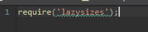
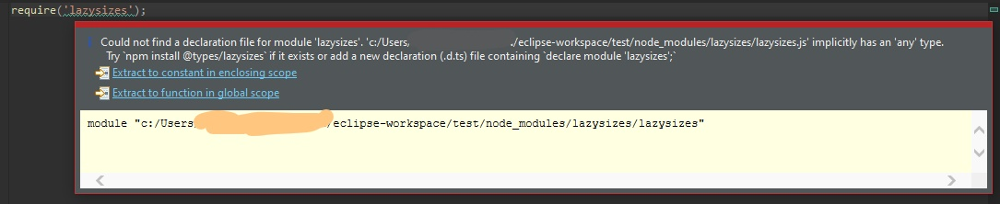

There's a problem I'm having with the wild west developer enviroment.

When I have a normal node js managed project **without** typescript I still get typescript errors.

**What i've tried**  
Making yet another new file tsconfig.json and setting the value "noImplicitAny" to false doesn't help
with the IDE not marking a library like lazysizes as normal valid code, but showing an error hint marking

When you hover it, you get to see the text

> Could not find a declaration file for module 'lazysizes'. 'c:/..../node_modules/lazysizes/lazysizes.js' implicitly has an 'any' type. Try npm install @types/lazysizes if
it exists or add a new declaration (.d.ts) file containing declare module 'lazysizes';

In short, I need a **javascript** editor and not a botched up typescript interpreter.

Ideally there'd be a setting on how to interpret the files, or it interpreting things via the presence of a tsconfig.json or not. But right now this is a major annoyance as it is not a valid error in a javascript context.

------

